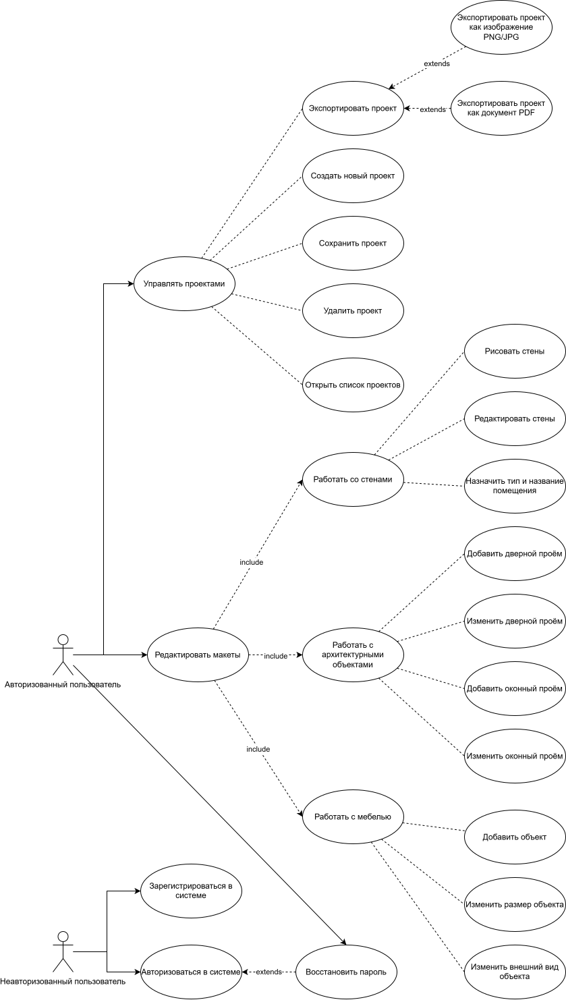

# Лабораторная работа №1

## Перечень заинтересованных лиц (стейкхолдеров)

### Студент (я)

Получает реальный практический опыт в проектировании и разработки полноценного программного продукта,
разработав качественную дипломную работу, в данном случае, web-приложение.

### Научный руководитель 

Направляет студента и корректирует получающиеся результаты для создания качественной дипломной работы и выпуска высококвалифицированного
специалиста, который будет представлен работодателям.

### Работодатели

Ищет среди студенческих работ ценные работы, которые могли бы быть реализованы в качестве продукта для продажи клиентам, а также
квалифицированных потенциальных работников, делающих качественные проекты.

### Потенциальные пользователи

Пользователи, которые нуждаются в онлайн-планировщике для создания макетов квартир, это могут быть как архитекторы, которым это необходимо
в профессиональной деятельности, так и просто люди, которые этим занимаются любительски или жильцы квартир, планирующие перестановку.

## Перечень функциональных требований

1. Пользователь должен иметь возможность зарегистрироваться или авторизоваться в системе, используя email и пароль, или 
через социальные сети (Yandex, VK).
2. Пользователь должен иметь возможность восстановить пароль.
3. Пользователь должен иметь возможность создать один или несколько проектов и сохранять их под своим именем.
4. Пользователь должен иметь возможность экспортировать проект в распространенные форматы: изображение (PNG, JPEG), PDF-документ.
5. Пользователь должен иметь возможность рисовать стены с указанием длины и угла.
6. Пользователь должен иметь возможность редактировать стены: перемещать узловые точки, изменять длину, толщину, тип линии (несущая, перегородка).
7. Система должна автоматически создавать комнату при замыкании контура стен.
8. Пользователь должен иметь возможность назначить помещению тип, например, гостиная, спальня, кухня, санузел, а также название.
9. Пользователь должен иметь возможность видеть и редактировать площадь каждого помещения, которая рассчитывается автоматически
10. Пользователь должен иметь возможность добавлять дверные проемы на стены.
11. Пользователь должен иметь возможность изменять размеры и направление открывания дверей.
12. Пользователь должен иметь возможность добавлять оконные проемы разных типов на стены.
13. Пользователь должен иметь возможность изменять размеры окон.
14. Система должна предоставлять каталог стандартных элементов мебели (шкаф, стол, стул и т.п.).
15. Пользователь должен иметь возможность перетаскивать (Drag-and-Drop) элемент из каталога на план.
16. Пользователь должен иметь возможность изменять размеры, поворачивать и перемещать размещенные объекты.
17. Пользователь должен иметь возможность изменять внешний вид объектов (цвет, текстура) из набора.

## Диаграмма вариантов использования

А также по [ссылке](use-case diagram.svg)

## Перечень сделанных предположений

1. Допустим, пользователь работает над проектом, не только на компьютере\ноутбуке, но и на планшете.
2. Предположим, что пользователь работает над крупным проектом из-за чего у пользователя появляется очень много объектов, интерфейс не должен зависать и долго думать в таком случае.
3. Допустим, что пользователь долго работает над проектом, например, целый день и забывает сохранить проект, закрывая вкладку, в этом случае проект должен быть сохранён без потери большого прогресса.

## Перечень нефункциональных требований

1. Время ответа редактора при работе с проектом средней сложности (до 100 графических объектов на плане) не должно превышать 100 мс. (Производительность)
2. Система должна обеспечивать автосохранение текущего состояния проекта не реже, чем каждые 30 секунд активности пользователя, и при каждом критическом действии, например, закрытии вкладки или браузера. (Надёжность и сохранность данных)
3. Клиентское веб-приложение должно полнофункционально работать на последних стабильных версиях браузеров Google Chrome, Mozilla Firefox, Microsoft Edge и Safari. (Кроссплатформенность и совместимость)
4. Пользовательский интерфейс должен быть адаптируемым и сохранять базовую работоспособность (просмотр, редактирование, сохранение) на планшетах с диагональю экрана от 10 дюймов и разрешением не менее 1024x768 пикселей. (Кроссплатформенность и совместимость)