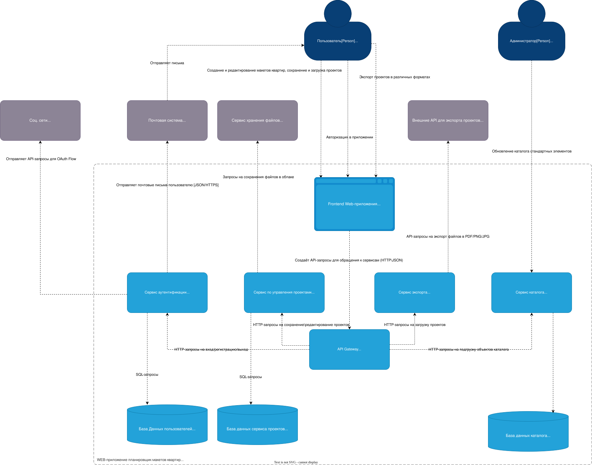
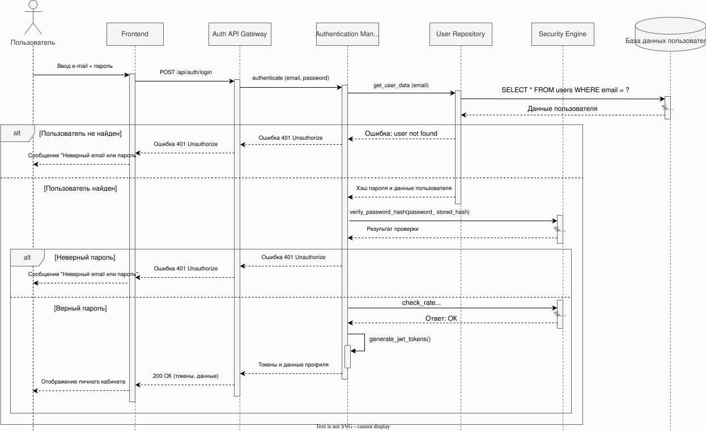
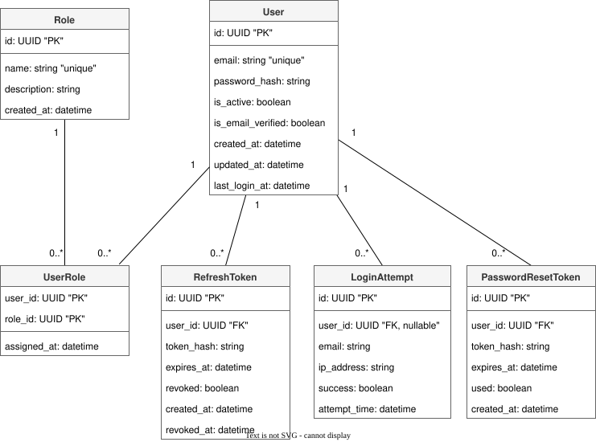

# Лабораторная работа №3
**Тема**: Использование принципов проектирования на уровне методов и классов

**Цель работы**: Получить опыт проектирования и реализации модулей с использованием принципов KISS, YAGNI, DRY, SOLID и др.
## Гуцол Степан РИС-22-3

---

## Выбранный Вариант использования

В качестве варианта использования выбран **сценарий авторизации зарегистрированного пользователя**, который реализуется через
контейнер **"Сервис аунтентификации"**, диаграмма которого представлена ниже

## Диаграмма контейнеров



---

## Диаграмма компонентов


---

## Диаграмма последовательностей

На основе этого варианта использования была построена следующая диааграмма последовательностей, которая расписывает
несколько возможных сценариев и демонстрирует взаимодействие внутренних компонентов контейнера:
- Система находит пользователя, проверяет корректность пароля и ограничений, генерирует JWT-токены и возвращает клиенту ответ 200 OK с данными профиля. (успешный)
- Система находит пользователя, но при проверке хеша пароля получает отрицательный результат и возвращает ответ 401 Unauthorized. (неуспешный)
- Система не находит пользователя по указанному email в базе данных и возвращает ответ 401 Unauthorized без выполнения дальнейших проверок. (неуспешный)



---

## Модель БД

Была построена модель БД для базы данных пользователей, которая хранит необходимую информацию о пользователях, таким образом
получилось 6 сущностей:
- **User** - хранит учетные данные пользователя и его статус в системе
- **Role** - определяет роль и уровень доступа пользователя.
- **UserRole** - связывает пользователей и роли (реализует связь многие ко многим).
- **RefreshToken** - хранит refresh-токены для обновления JWT и управления сессиями.
- **LoginAttempt** - фиксирует попытки входа для реализации rate limiting и мониторинга безопасности.
- **PasswordResetToken** - хранит токены для процедуры сброса пароля.



---

## Применение основных принципов разработки

### Серверная часть

Серверная часть приложения представляет из себя бэкенд, написанный на Python FastAPI, который позволяет обрабатывать HTTP-запросы,
в данном случае позволяет реализовать простейший эндпоинт авторизации

Серверная часть имеет следующую структуру:
```
src/app/
 |- main.py - Инициирует запуск бэкенда, описывает HTTP-эндпоинт и связывает запросы клиента с бизнес-логикой сервиса.
 |- models.py - определяет модель пользователя и хранит упрощённую "базу данных".
 |- schemas.py - описывает Pydantic-схемы запросов и ответов для валидации и сериализации данных API.
 |- repository.py - реализует слой доступа к данным и предоставляет методы получения пользователя из хранилища.
 |- services.py - содержит бизнес-логику аутентификации (проверка пользователя и генерация токена).
 |- security.py - отвечает за хеширование паролей, их проверку и создание JWT-токенов.
 ```


### Клиентская часть

Клиентская часть представляет из себя упрощённый Frontend в виде WEB-страницы, написанный на HTML с небольшой JS-функцией для отправки
запроса на бэкенд приложения

Клиентская часть имеет следующую структуру:
```
src/app/
 |- index.html - HTML-страница, на которой можно ввести данные пользователя и отправить запрос на бэкенд
 ```

---

### Описание использования принципов

#### KISS (Keep It Simple)

- Используется упрощённая версия "БД" вместо сложной ORM.
- Минимальный набор сущностей (одна).
- Нет лишних абстракций.
- Один endpoint /login.

#### YAGNI (You Aren’t Gonna Need It)

Реализовано только то, что нужно для авторизации, а именно нет дополнительных необходимых в будущем механизмов?
- Нет refresh-токенов.
- Нет ролей (не используются в текущем сценарии).
- Нет сложной системы rate limit.


#### DRY (Don’t Repeat Yourself)

Вся логика чётко вынесена в их компоненты, например,логика хеширования вынесена в security.py, а 
логика работы с пользователем — в repository.py. Нет дублирования проверки пароля.

#### SOLID
**S — Single Responsibility (принцип единственной ответственности)**

Каждый компонент приложения обладает своей единственной зоной ответственности, например:
- UserRepository — только работа с данными.
- AuthService — только бизнес-логика авторизации.
- security.py — только криптография.

**O — Open/Closed (принцип открытости/закрытости)**

Этот принцип реализуется, так как довольно легко можно внедрить и масштабировать код, без необходимости модификаций, например
можно добавить:
- PostgreSQL в качестве БД для хранения данных.
- OAuth через другие сервисы.

**L — Liskov Substitution (принцип подстановки Барбары Лисков)**

Этот принцип реализуется, например, если создать PostgresUserRepository, он сможет заменить UserRepository без изменений 
компонента AuthService.

**I — Interface Segregation  (принцип разделения интерфейсов)**

Сервис не зависит от лишних методов репозитория — только get_by_email.

**D — Dependency Inversion (принцип инверсии зависимостей)**

AuthService зависит от абстракции (репозитория), а не от конкретной БД.

---

## Дополнительные принципы разработки

### BDUF (Big Design Up Front)

Не использовался, так как сервис небольшой и избыточное предварительное проектирование усложнило бы разработку без 
практической пользы.

### SoC (Separation of Concerns)

Принцип разделения ответственности был применён: HTTP-слой (FastAPI), бизнес-логика (AuthService), работа с данными 
(Repository) и безопасность (security.py) разделены на отдельные компоненты.

### MVP (Minimum Viable Product)

Подход минимально-жизнеспособного продукта использовался, реализована только базовая функциональность — авторизация 
пользователя по email и паролю с выдачей JWT.

### PoC (Proof of Concept)

Применён, поскольку используется упрощённая in-memory "база данных" и упрощённая безопасность для демонстрации работоспособности
архитектурного решения.


