# Лабораторная работа №4

**Тема:** Проектирование REST API

**Цель работы:** Получить опыт проектирования программного интерфейса.

## Гуцол Степан РИС-22-3

--- 

## Описание запросов

### Регистрация пользователя - ```POST /users```

#### Описание:

Создание нового пользователя.


#### Параметры:

- email (string, required, unique) - адрес электронной почты.
- password (string, required, min: 8) - пароль.
- is_active (boolean, optional, default: true) - статус активности.

#### Пример запроса:

```JSON
{
  "email": "user@example.com",
  "password": "string(min:8)",
  "is_active": true
}
```

#### Коды ответа:

- 201 Created — успешно создан аккаунт.
- 400 Bad Request — пользователь уже существует.

#### Пример ответа:

``` JSON
{
  "id": "uuid",
  "email": "user@example.com",
  "is_active": true,
  "created_at": "2026-02-25T12:00:00Z"
}
```

---

### Авторизация пользователя - ```POST /auth/login ```

#### Описание:

Аутентификация пользователя и выдача JWT токена.

#### Параметры:

- email (string, required) - адрес электронной почты
- password (string, required) - пароль

#### Пример запроса:

```JSON
{
  "email": "user@example.com",
  "password": "string"
}
```

#### Коды ответа:

- 200 OK — успешный вход в аккаунт.
- 401 Unauthorized — пользователь не авторизовался.

#### Пример ответа:

200

``` JSON
{
  "access_token": "jwt_token_string",
  "token_type": "bearer",
  "expires_in": 1800
}
```

401

``` JSON
{
  "detail": "Неверные данные"
}
```

---

### Получение профиля пользователя - ```GET /users/{user_id} ```

#### Описание:

Возвращает данные пользователя.

#### Параметры пути:

- user_id (UUID) - уникальный идентификатор пользователя

#### Заголовки:

```
Authorization: Bearer <token>
```

#### Коды ответа:

- 200 OK — успешно создан аккаунт.
- 404 Not Found — пользователь не найден.

#### Пример ответа:

200

``` JSON
{
  "id": "uuid",
  "email": "user@example.com",
  "is_active": true,
  "roles": ["USER"],
  "created_at": "2026-02-25T12:00:00Z"
}
```

---

### Обновление данных пользователя - ```PUT /users/{user_id} ```

#### Описание:

Обновление данных пользователя.

#### Параметры пути:

- user_id (UUID) - уникальный идентификатор пользователя

#### Параметры запроса:

- email (string, required, unique) - новый адрес электронной почты.
- is_active (boolean, optional, default: true) - статус активности.

#### Пример запроса:

```JSON
{
  "email": "new@example.com",
  "is_active": true
}
```

#### Коды ответа:

- 200 OK — успешно обновлён аккаунт.
- 404 Not Found — пользователь не найден.

#### Пример ответа:

200

``` JSON
{
  "message": "Пользователь успешно обновлён"
}
```

---

### Удаление пользователя  - ```DELETE /users/{user_id} ```

#### Описание:

Удаление пользователя из системы.

#### Параметры пути:

- user_id (UUID) - уникальный идентификатор пользователя

#### Коды ответа:

- 204 No Content - при успешном удалении тело отсутствует.
- 404 Not Found — пользователь не найден.

---

### Обновление пароля - ```PUT /users/{user_id}/password ```

#### Описание:

Изменение пароля пользователя.

#### Параметры пути:

- user_id (UUID) - уникальный идентификатор пользователя

#### Параметры запроса:

- old_password (string, required, unique) - старый пароль.
- new_password (string, required, min: 8) - новый пароль.

#### Пример запроса:

```JSON
{
  "old_password": "string",
  "new_password": "string(min:8)"
}
```

#### Коды ответа:

- 200 OK — успешно обновлён аккаунт.
- 401 Unauthorized — пользователь неправильно ввёл старый пароль.

#### Пример ответа:

200

``` JSON
{
  "message": "Пароль успешно обновлён"
}
```

---

### Получение списка пользователей - ```GET /users ```

#### Описание:

Возвращает список пользователей (только для пользователя с ролью администратора).


#### Параметры запроса:

- limit (int, optional, default: 10)
- offset (int, optional, default: 0)

#### Пример запроса:

```query
GET /users?limit=5&offset=0
```

#### Коды ответа:

- 200 OK — Список пользователей в ответе.

#### Пример ответа:

200

``` JSON
{
  "total": 100,
  "items": [
    {
      "id": "uuid",
      "email": "user1@example.com",
      "is_active": true
    }
  ]
}
```

---

### Выход из системы - ```POST /auth/logout ```

#### Описание:

Выход из системы - инвалидация текущего токена.

#### Заголовки:

```
Authorization: Bearer <token>
```

#### Коды ответа:

- 200 OK — Успешный выход из аккаунта.

#### Пример ответа:

200

``` JSON
{
  "message": "Успешный выход из аккаунта"
}
```

---

## Реализация

При реализации были сохранены архитектурные подходы из лабораторной работы №3, поэтому также аналогично весь код с реализацией
можно найти по пути, а HTTP-слой полностью изолирован в main.py для удобства тестирования и реализации:

```
src/app/
```

Кроме того, FastAPI обладает внедрённым Swagger, который доступен по ссылке  `http://127.0.0.1:8000/docs` при запуске проекта,
это удобный инструмент для просмотра и тестирования API, но в рамках лабораторной работы будет использоваться иснтрумент PostMan.

---

## Тестирование

### Регистрация пользователя - ```POST /users```

#### Тест 1 - Успешное создание пользователя

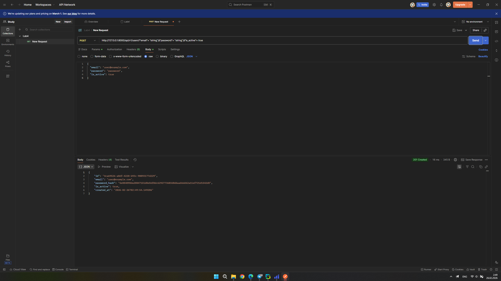

#### Тест 2 - Повторное использование email

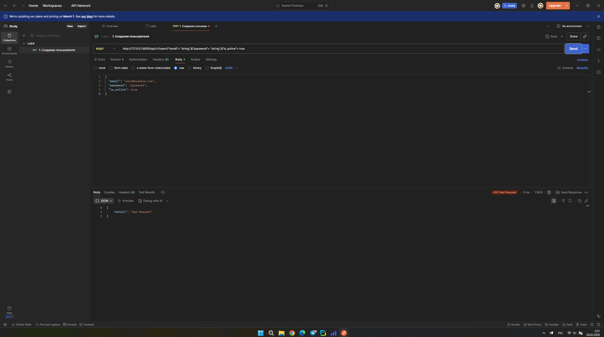

#### Код автотестов

``` doctest
pm.test("Status is 201", function () {
    pm.response.to.have.status(201);
});

pm.test("User has id", function () {
    var json = pm.response.json();
    pm.expect(json).to.have.property("id");
});

pm.test("Status is 400", function () {
    pm.response.to.have.status(400);
});
```

### Авторизация пользователя - ```POST /auth/login ```

#### Тест 1 - Успешный вход

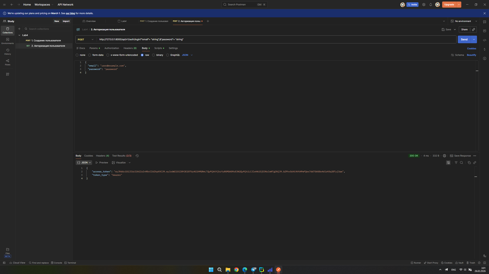

#### Тест 2 - Ввод неверного пароля

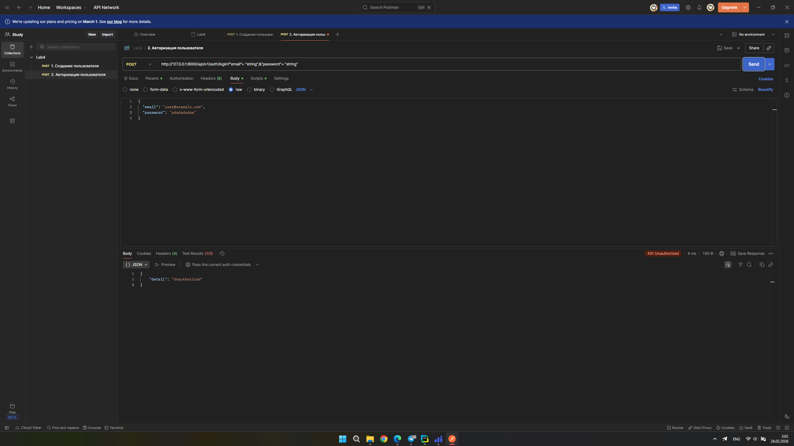

#### Код автотестов

``` doctest
pm.test("Status is 200", function () {
    pm.response.to.have.status(200);
});

pm.test("Token returned", function () {
    var json = pm.response.json();
    pm.expect(json).to.have.property("access_token");
});

pm.test("Status is 401", function () {
    pm.response.to.have.status(401);
});
```

### Получение профиля пользователя - ```GET /users/{user_id} ```

#### Тест 1 - Успешное получение данных профиля

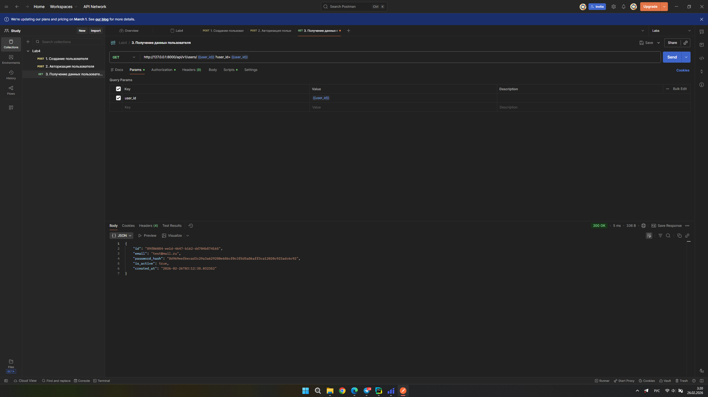

#### Тест 2 - Аккаунта не существует

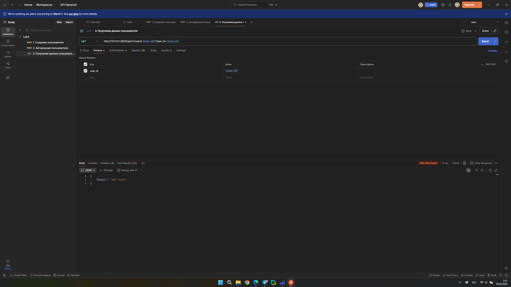

#### Код автотестов

``` doctest
pm.test("Status is 200", function () {
    pm.response.to.have.status(200);
});

pm.test("Status is 404", function () {
    pm.response.to.have.status(404);
});
```

### Обновление данных пользователя - ```PUT /users/{user_id} ```

#### Тест 1 - Успешное обновление пользователя

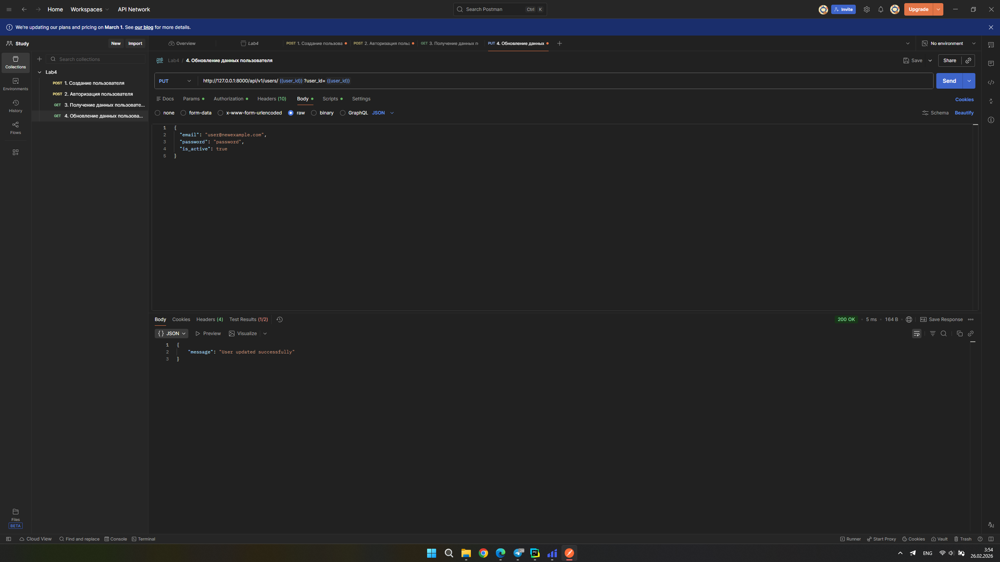

#### Тест 2 - Ненайденный профиль (если проблемы с токеном или не существует профиля с ID)

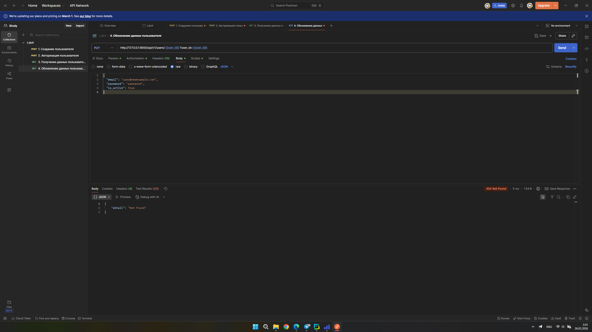

#### Код автотестов

``` doctest
pm.test("Status is 200", function () {
    pm.response.to.have.status(200);
});

pm.test("Status is 404", function () {
    pm.response.to.have.status(404);
});
```

### Удаление пользователя  - ```DELETE /users/{user_id} ```

#### Тест 1 - Успешное удаление пользователя

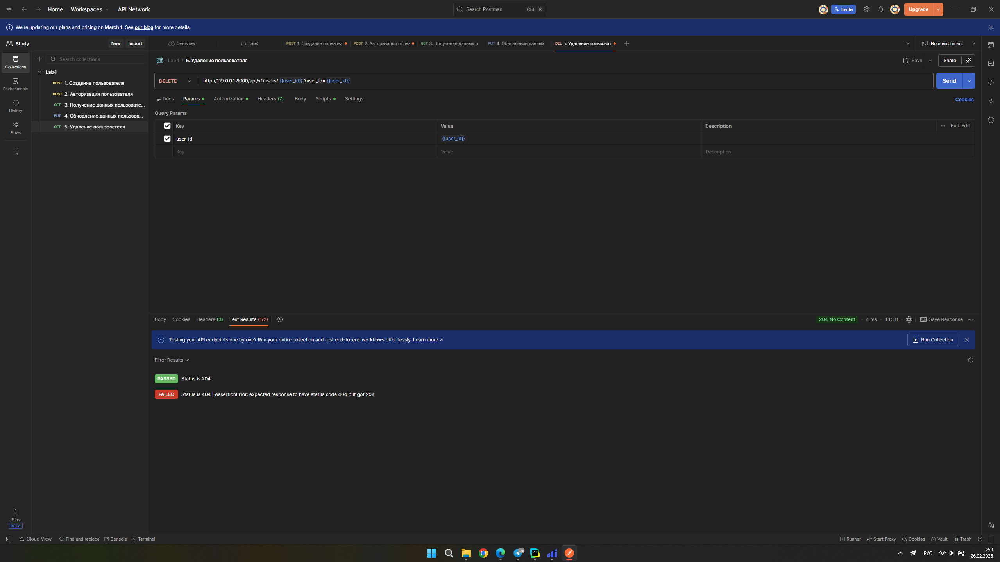

#### Тест 2 - Пользователь не найден

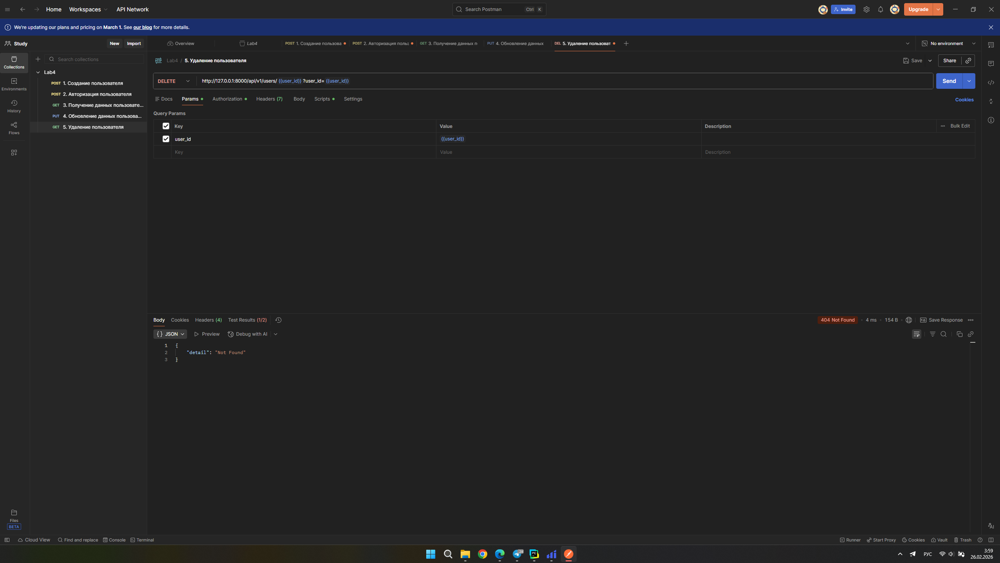

#### Код автотестов

``` doctest
pm.test("Status is 204", function () {
    pm.response.to.have.status(204);
});

pm.test("Status is 404", function () {
    pm.response.to.have.status(404);
});
```

### Обновление пароля - ```PUT /users/{user_id}/password ```

#### Тест 1 - Успешное обновление пароля пользователя

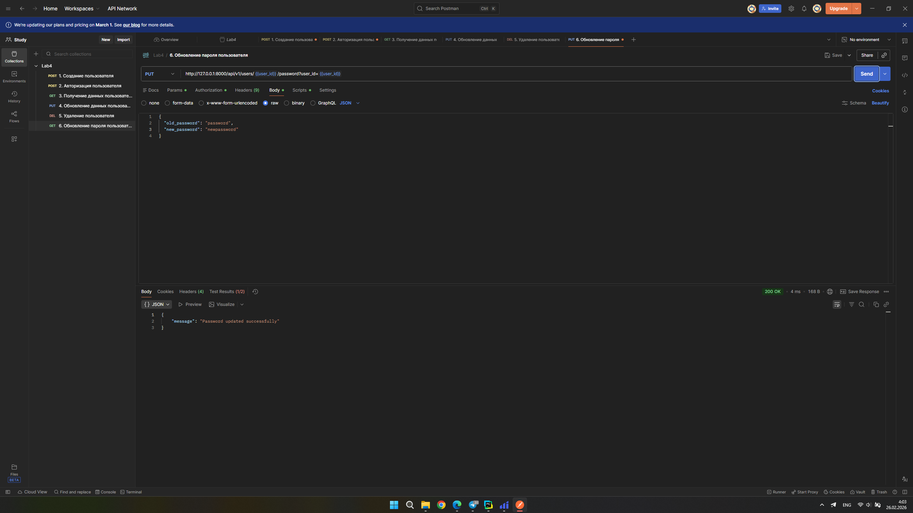

#### Тест 2 - Неверно введённый старый пароль

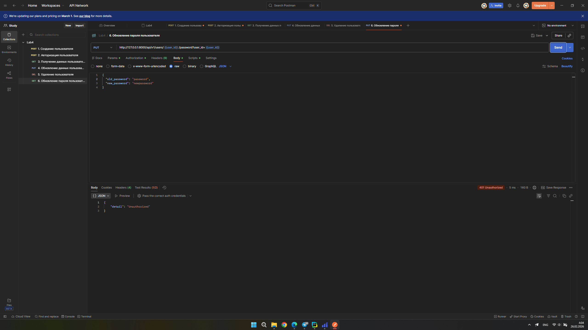

#### Код автотестов

``` doctest
pm.test("Status is 200", function () {
    pm.response.to.have.status(200);
});

pm.test("Status is 401", function () {
    pm.response.to.have.status(401);
});
```

### Получение списка пользователей - ```GET /users ```

#### Тест 1 - Успешное получение списка пользователей (с токеном)

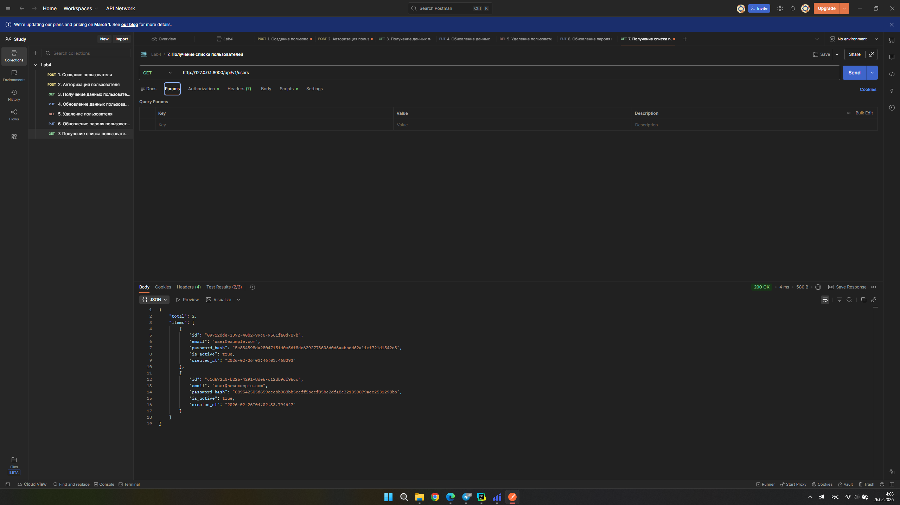

#### Тест 2 - Невозможность получить список (без токена)

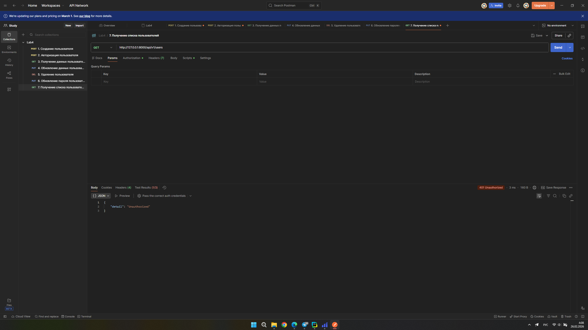

#### Код автотестов

``` doctest
pm.test("Status is 200", function () {
    pm.response.to.have.status(200);
});

pm.test("Has items array", function () {
    var json = pm.response.json();
    pm.expect(json).to.have.property("items");
});

pm.test("Status is 401", function () {
    pm.response.to.have.status(401);
});
```

### Выход из системы - ```POST /auth/logout ```

#### Тест 1 - Успешное выход из аккаунта

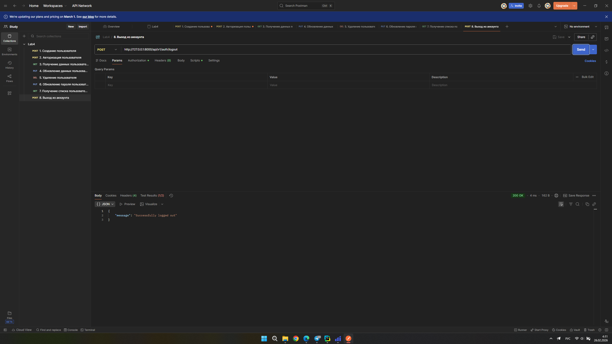

#### Тест 2 - Повторное использование истёкшего токена

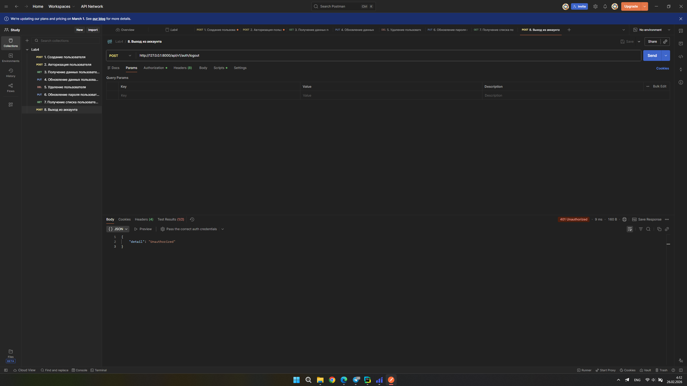

#### Код автотестов

``` doctest
pm.test("Status is 200", function () {
    pm.response.to.have.status(200);
});

pm.test("Token should be invalid", function () {
    pm.response.to.have.status(401);
});
```