# Лабораторная работа №6

**Тема:** Использование шаблонов проектирования

**Цель работы:** Получить опыт применения шаблонов проектирования при написании кода программной системы.

## Гуцол Степан РИС-22-3

--- 

# GoF шаблоны проектирования (на основе лабораторной работы №5 и ранее)

---

# Gang of Four (GOF)

# Порождающие шаблоны

>[!Порождающие шаблоны]
>отвечают за _создание объектов_: как именно они создаются, кем и когда. Помогают скрыть детали создания, уменьшить зависимость кода от конкретных классов и упростить замену реализаций.
## 1. Singleton

### Общее назначение
**Singleton** гарантирует существование **единственного экземпляра** класса и предоставляет глобальную точку доступа к нему.

### Назначение в проекте
В проекте полезно иметь единый экземпляр:
- конфигурации приложения (настройки JWT, DB URL),
- фабрики подключения к БД/engine.

### UML
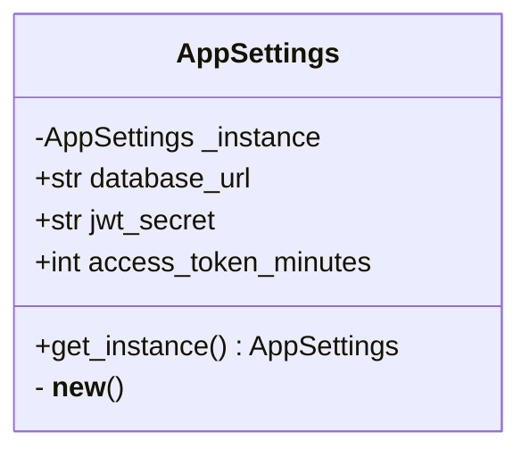

``` Python
import os
from dataclasses import dataclass

@dataclass
class AppSettings:
    database_url: str
    jwt_secret: str
    access_token_minutes: int

    _instance = None

    def __new__(cls, *args, **kwargs):
        if cls._instance is None:
            cls._instance = super().__new__(cls)
        return cls._instance

    @classmethod
    def get_instance(cls) -> "AppSettings":
        inst = cls(
            database_url=os.getenv("DATABASE_URL", "postgresql://app:app@db:5432/app"),
            jwt_secret=os.getenv("JWT_SECRET", "change-me"),
            access_token_minutes=int(os.getenv("ACCESS_TOKEN_MINUTES", "30")),
        )
        return inst
```
---
## 2. Factory Method

### Общее назначение

**Factory Method** делегирует создание объектов подклассам/фабрике, скрывая конкретные классы от клиента.

### Назначение в проекте

Проект уже проходил эволюцию от **in-memory** хранилища к **PostgreSQL**.  
Factory Method позволяет переключать реализацию репозитория без переписывания сервисов:

- `InMemoryUserRepository`
- `SqlAlchemyUserRepository`

### UML

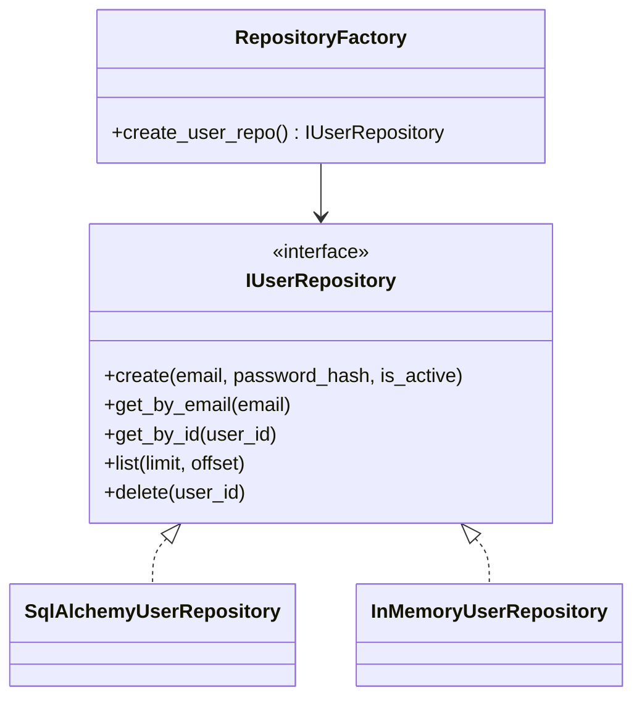


### Код

``` Python
import os  
from sqlalchemy.orm import Session  
  
class IUserRepository:  
    def create(self, email: str, password_hash: str, is_active: bool): ...  
    def get_by_email(self, email: str): ...  
    def get_by_id(self, user_id: str): ...  
    def list(self, limit: int, offset: int): ...  
    def delete(self, user_id: str): ...  
  
class RepositoryFactory:  
    def __init__(self, db: Session | None = None):  
        self.db = db  
  
    def create_user_repo(self) -> IUserRepository:  
        mode = os.getenv("REPO_MODE", "db")  # db / memory  
        if mode == "memory":  
            return InMemoryUserRepository()  
        if self.db is None:  
            raise RuntimeError("DB session is required for db repository")  
        return SqlAlchemyUserRepository(self.db)  
  
  
class InMemoryUserRepository(IUserRepository):  
    _users = {}  
    def create(self, email, password_hash, is_active): ...  
    def get_by_email(self, email): ...  
    def get_by_id(self, user_id): ...  
    def list(self, limit, offset): ...  
    def delete(self, user_id): ...  
  
class SqlAlchemyUserRepository(IUserRepository):  
    def __init__(self, db: Session):  
        self.db = db  
    def create(self, email, password_hash, is_active): ...  
    def get_by_email(self, email): ...  
    def get_by_id(self, user_id): ...  
    def list(self, limit, offset): ...  
    def delete(self, user_id): ...
    
```
---
## 3. Builder

### Общее назначение

**Builder** пошагово конструирует сложный объект, отделяя процесс сборки от представления.

### Назначение в проекте

JWT-токен — это объект, который можно “собирать” из:

- `sub` (user_id),
- `exp (когда истекает)`,
- `iat (когда выпущен)`,
- `scopes (роль)`, `issuer (кем выпущен)`, и т.п.

Builder позволяет централизованно добавлять claims и менять структуру токена без правки всех сервисов.

### UML
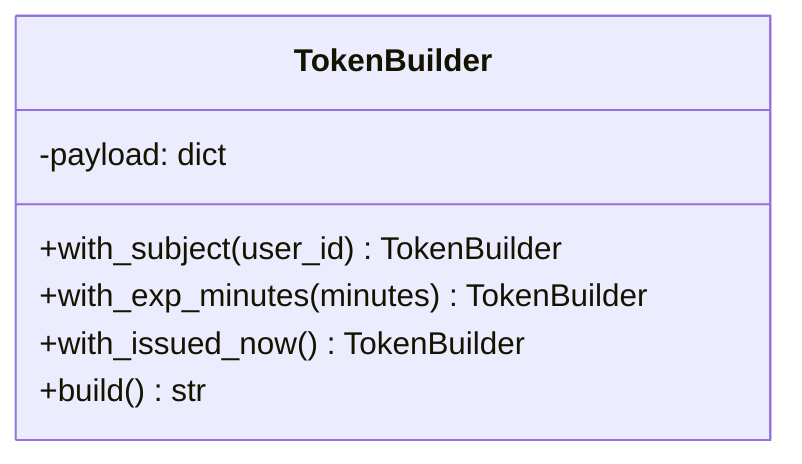
### Код
``` python
from datetime import datetime, timedelta  
import jwt  
  
class TokenBuilder:  
    def __init__(self, secret: str, algorithm: str = "HS256"):  
        self.secret = secret  
        self.algorithm = algorithm  
        self.payload: dict = {}  
  
    def with_subject(self, user_id: str) -> "TokenBuilder":  
        self.payload["sub"] = user_id  
        return self  
  
    def with_exp_minutes(self, minutes: int) -> "TokenBuilder":  
        self.payload["exp"] = datetime.utcnow() + timedelta(minutes=minutes)  
        return self  
  
    def with_issued_now(self) -> "TokenBuilder":  
        self.payload["iat"] = datetime.utcnow()  
        return self  
  
    def build(self) -> str:  
        return jwt.encode(self.payload, self.secret, algorithm=self.algorithm)  

# Использование в сервисе авторизации  
# token = TokenBuilder(SECRET_KEY).with_subject(user.id).with_issued_now().with_exp_minutes(30).build()
```

---

# Структурные шаблоны

>[!Структурные шаблоны]
>отвечают за _составление объектов и классов в более крупные структуры_: как связывать компоненты между собой (оборачивать, адаптировать, объединять), чтобы получить нужную функциональность без переписывания существующего кода.
## 4. Adapter

### Общее назначение

**Adapter** приводит интерфейс одного класса к интерфейсу, ожидаемому клиентом.

### Назначение в проекте

SQLAlchemy-модель/сессия “не похожи” на простой интерфейс репозитория (как раньше in-memory).  
Adapter позволяет:

- скрыть особенности ORM,
- сохранить интерфейс репозитория для сервисов.

### UML
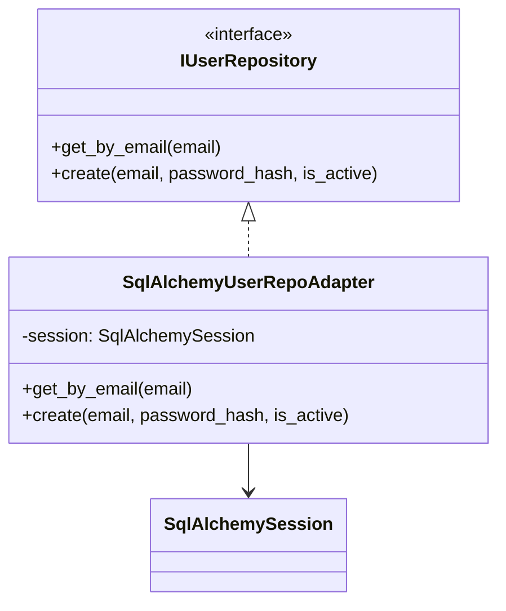
### Код
``` python

from sqlalchemy.orm import Session  
from app.models import User  

class IUserRepository:  
    def get_by_email(self, email: str): ...  
    def create(self, email: str, password_hash: str, is_active: bool): ...  
  
class SqlAlchemyUserRepoAdapter(IUserRepository):  
    def __init__(self, session: Session):  
        self.session = session  
  
    def get_by_email(self, email: str) -> User | None:  
        return self.session.query(User).filter(User.email == email).first()  
  
    def create(self, email: str, password_hash: str, is_active: bool) -> User:  
        user = User(id="...", email=email, password_hash=password_hash, is_active=is_active)  
        self.session.add(user)  
        self.session.commit()  
        self.session.refresh(user)  
        return user

```

---

## 5. Facade

### Общее назначение

**Facade** предоставляет упрощённый интерфейс к набору подсистем.

### Назначение в проекте

У нас есть подсистемы:

- репозиторий,
- хеширование паролей,
- JWT,
- blacklist.

Facade даёт удобные методы уровня “бизнес-операций”:

- `register_user()`, `login_user()`, `logout_user()`, `change_password()`

### UML

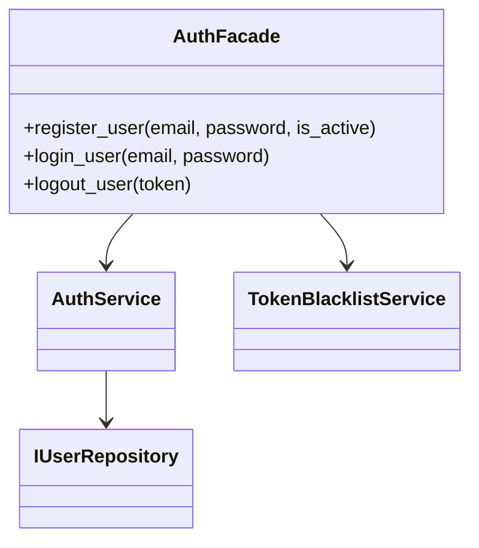

### Код

``` python
from app.service import AuthService  
from app.repository import UserRepository  
  

class TokenBlacklistService:  
    def __init__(self, repo: UserRepository):  
        self.repo = repo  
  
    def revoke(self, token: str, user_id: str):  
        self.repo.blacklist_add(token, user_id)  
  
class AuthFacade:  
    def __init__(self, repo: UserRepository):  
        self.auth = AuthService(repo)  
        self.blacklist = TokenBlacklistService(repo)  
  
    def register_user(self, email: str, password: str, is_active: bool):  
        return self.auth.register(email, password, is_active)  
  
    def login_user(self, email: str, password: str) -> str:  
        return self.auth.login(email, password)  
  
    def logout_user(self, token: str, user_id: str):  
        self.blacklist.revoke(token, user_id)
```

---

## 6. Decorator

### Общее назначение

**Decorator** динамически добавляет объекту новую функциональность без изменения исходного класса.

### Назначение в проекте

Нужно добавлять:

- логирование,
- метрики,
- трассировку

не меняя репозиторий/сервис.

### UML

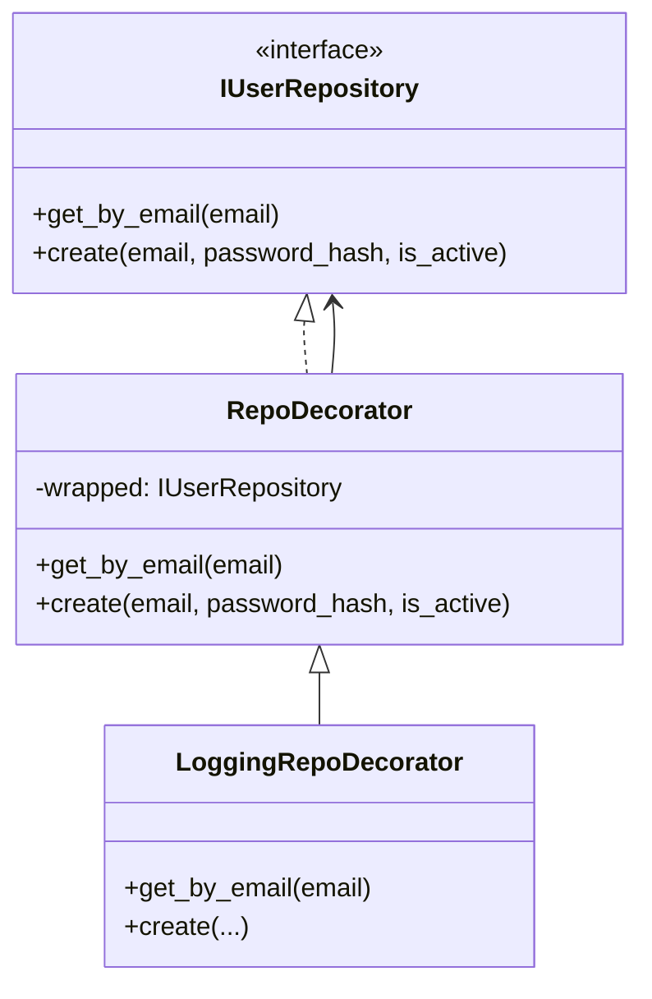

### Код


``` python
import time  
import logging  
  
logger = logging.getLogger("repo")  
  
class IUserRepository:  
    def get_by_email(self, email: str): ...  
    def create(self, email: str, password_hash: str, is_active: bool): ...  
  
class RepoDecorator(IUserRepository):  
    def __init__(self, wrapped: IUserRepository):  
        self.wrapped = wrapped  
  
    def get_by_email(self, email: str):  
        return self.wrapped.get_by_email(email)  
  
    def create(self, email: str, password_hash: str, is_active: bool):  
        return self.wrapped.create(email, password_hash, is_active)  
  
class LoggingRepoDecorator(RepoDecorator):  
    def get_by_email(self, email: str):  
        t0 = time.time()  
        res = super().get_by_email(email)  
        logger.info("get_by_email(%s) took %.2fms", email, (time.time() - t0)*1000)  
        return res  
  
    def create(self, email: str, password_hash: str, is_active: bool):  
        logger.info("create user %s", email)  
        return super().create(email, password_hash, is_active)
```

---

## 7. Proxy

### Общее назначение

**Proxy** предоставляет заместителя объекта, контролируя доступ к нему (кэширование, ленивое создание, безопасность).

### Назначение в проекте

Проверка токена и blacklist — это контроль доступа к “защищённым” операциям.  
Proxy может оборачивать репозиторий/сервис и запрещать вызовы, если токен отозван.

### UML

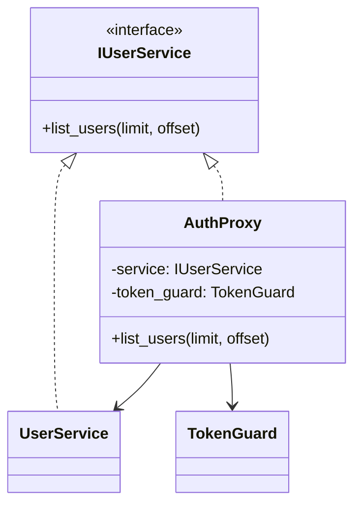

### Код

``` python
from fastapi import HTTPException  
  
class TokenGuard:  
    def __init__(self, blacklist_checker):  
        self.blacklist_checker = blacklist_checker  
  
    def ensure_allowed(self, token: str):  
        if self.blacklist_checker(token):  
            raise HTTPException(status_code=401, detail="Token revoked")  
  
class IUserService:  
    def list_users(self, limit: int, offset: int): ...  
  
class AuthProxy(IUserService):  
    def __init__(self, service: IUserService, guard: TokenGuard, token: str):  
        self.service = service  
        self.guard = guard  
        self.token = token  
  
    def list_users(self, limit: int, offset: int):  
        self.guard.ensure_allowed(self.token)  
        return self.service.list_users(limit, offset)
```

---
# Поведенческие шаблоны

> [!Поведенческие шаблоны]
>отвечают за _взаимодействие объектов и распределение ответственности_: как объекты общаются, кто за что отвечает, как организовать алгоритмы, события, цепочки обработчиков и изменения поведения без жёстких связей.
## 8. Strategy

### Общее назначение

**Strategy** инкапсулирует алгоритмы и позволяет заменять их во время выполнения.

### Назначение в проекте

Алгоритм хеширования паролей может меняться:

- bcrypt (по умолчанию),
- sha256 (как было раньше),
- argon2 (в будущем).

### UML

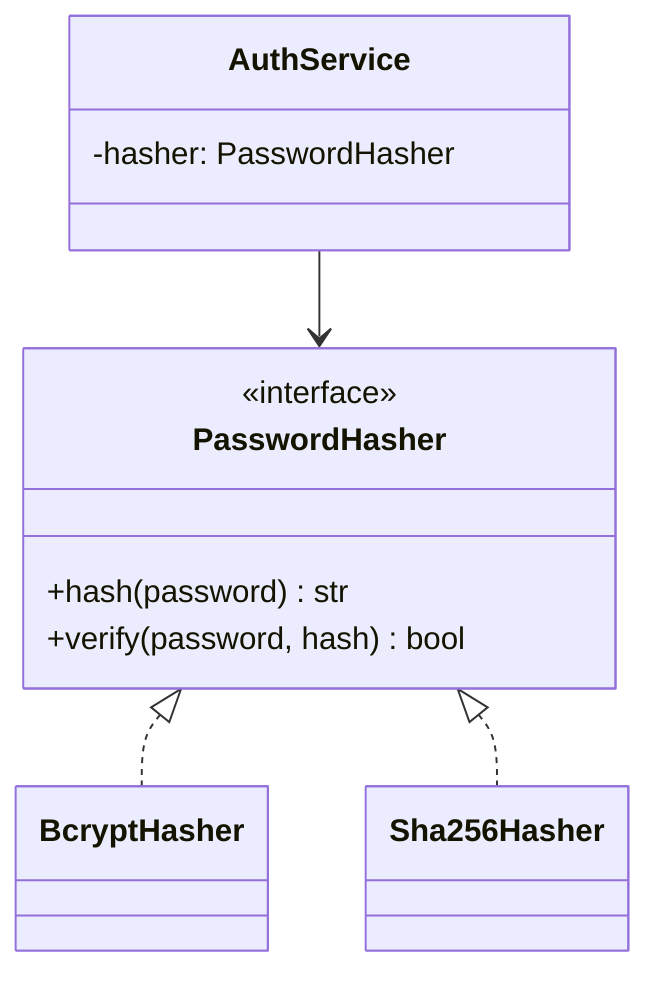

### Код

``` python
import hashlib  
from passlib.context import CryptContext  
  
class PasswordHasher:  
    def hash(self, password: str) -> str: ...  
    def verify(self, password: str, password_hash: str) -> bool: ...  
  
class Sha256Hasher(PasswordHasher):  
    def hash(self, password: str) -> str:  
        return hashlib.sha256(password.encode()).hexdigest()  
    def verify(self, password: str, password_hash: str) -> bool:  
        return self.hash(password) == password_hash  
  
class BcryptHasher(PasswordHasher):  
    _ctx = CryptContext(schemes=["bcrypt"], deprecated="auto")  
    def hash(self, password: str) -> str:  
        return self._ctx.hash(password)  
    def verify(self, password: str, password_hash: str) -> bool:  
        return self._ctx.verify(password, password_hash)  

  
# В AuthService можно внедрять нужную стратегию через конструктор
```
---

## 9. Observer

### Общее назначение

**Observer** устанавливает отношение “один-ко-многим”: при изменении состояния субъекта наблюдатели уведомляются автоматически.

### Назначение в проекте

Уведомления при событиях:

- пользователь зарегистрирован,
- выполнен логин,
- выполнен logout.

Наблюдатели:

- логгер,
- аудит в БД,
- метрики.

### UML

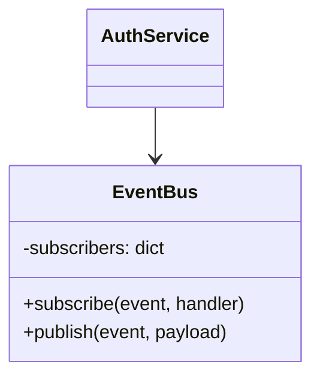

### Код

``` python
from collections import defaultdict  
from typing import Callable, Any  
  
class EventBus:  
    def __init__(self):  
        self._subscribers = defaultdict(list)  
  
    def subscribe(self, event: str, handler: Callable[[dict], Any]):  
        self._subscribers[event].append(handler)  
  
    def publish(self, event: str, payload: dict):  
        for handler in self._subscribers[event]:  
            handler(payload)  
  
# Пример использования  
# bus.publish("user_registered", {"email": email, "user_id": user.id})
```

---

## 10. Command

### Общее назначение

**Command** инкапсулирует запрос как объект, позволяя параметризовать операции, логировать и выстраивать очереди.

### Назначение в проекте

Операции вроде logout удобно представить командой:

- входные данные (token, user_id),
- метод `execute()`

### UML

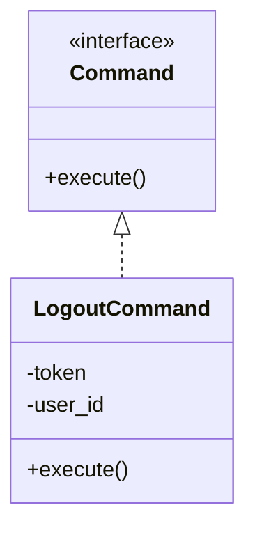

### Код

``` python 
class Command:  
    def execute(self): ...  
  
class LogoutCommand(Command):  
    def __init__(self, blacklist_service, token: str, user_id: str):  
        self.blacklist_service = blacklist_service  
        self.token = token  
        self.user_id = user_id  
  
    def execute(self):  
        self.blacklist_service.revoke(self.token, self.user_id)  
  
# Использование в роуте:  
# LogoutCommand(blacklist, token, current.id).execute()
```

---

## 11. Chain of Responsibility

### Общее назначение

**Chain of Responsibility** передаёт запрос по цепочке обработчиков, пока один из них не обработает его.

### Назначение в проекте

Проверка авторизации — это естественная цепочка:

1. проверка заголовка `Authorization`
2. проверка формата `Bearer`
3. проверка blacklist
4. декодирование JWT
5. проверка существования пользователя

### UML

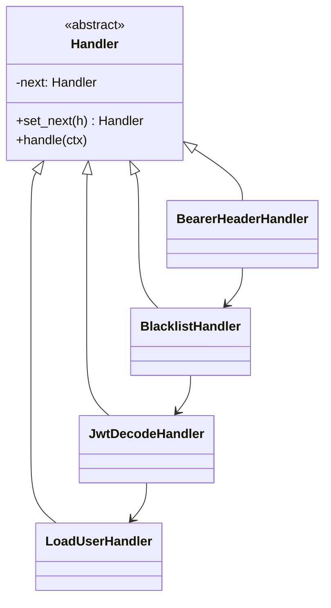

### Код

``` python
from fastapi import HTTPException  
  
class Handler:  
    def __init__(self):  
        self._next: "Handler | None" = None  
  
    def set_next(self, h: "Handler") -> "Handler":  
        self._next = h  
        return h  
  
    def handle(self, ctx: dict) -> dict:  
        if self._next:  
            return self._next.handle(ctx)  
        return ctx  
  
class BearerHeaderHandler(Handler):  
    def handle(self, ctx: dict) -> dict:  
        auth = ctx.get("authorization", "")  
        if not auth.startswith("Bearer "):  
            raise HTTPException(status_code=401, detail="Missing Bearer token")  
        ctx["token"] = auth.split()[1]  
        return super().handle(ctx)  
  
class BlacklistHandler(Handler):  
    def __init__(self, is_blacklisted):  
        super().__init__()  
        self.is_blacklisted = is_blacklisted  
  
    def handle(self, ctx: dict) -> dict:  
        if self.is_blacklisted(ctx["token"]):  
            raise HTTPException(status_code=401, detail="Token revoked")  
        return super().handle(ctx)  
  
class JwtDecodeHandler(Handler):  
    def __init__(self, decode):  
        super().__init__()  
        self.decode = decode  
  
    def handle(self, ctx: dict) -> dict:  
        try:  
            payload = self.decode(ctx["token"])  
        except Exception:  
            raise HTTPException(status_code=401, detail="Invalid token")  
        ctx["user_id"] = payload.get("sub")  
        return super().handle(ctx)  
  
class LoadUserHandler(Handler):  
    def __init__(self, repo):  
        super().__init__()  
        self.repo = repo  
  
    def handle(self, ctx: dict) -> dict:  
        user = self.repo.get_by_id(ctx["user_id"])  
        if not user:  
            raise HTTPException(status_code=404, detail="User not found")  
        ctx["user"] = user  
        return super().handle(ctx)
```

---

## 12. Template Method

### Общее назначение

**Template Method** задаёт “скелет” алгоритма в базовом классе, позволяя подклассам переопределять отдельные шаги.

### Назначение в проекте

Общие операции в сервисах часто имеют одинаковую структуру:

- валидация
- получение сущностей
- действие
- публикация события/логирование

Template Method позволяет унифицировать такие сценарии.

### UML

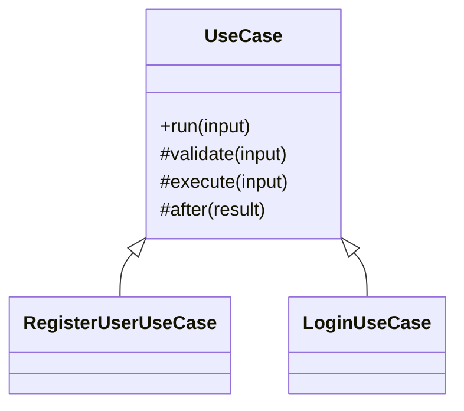
### Код

``` python
class UseCase:  
    def run(self, data: dict):  
        self.validate(data)  
        result = self.execute(data)  
        self.after(result)  
        return result  
  
    def validate(self, data: dict):  
        pass  
  
    def execute(self, data: dict):  
        raise NotImplementedError  
  
    def after(self, result):  
        pass  
  
  
class RegisterUserUseCase(UseCase):  
    def __init__(self, facade, event_bus=None):  
        self.facade = facade  
        self.event_bus = event_bus  
  
    def validate(self, data: dict):  
        if "email" not in data or "password" not in data:  
            raise ValueError("email/password required")  
  
    def execute(self, data: dict):  
        return self.facade.register_user(data["email"], data["password"], data.get("is_active", True))  
  
    def after(self, result):  
        if self.event_bus:  
            self.event_bus.publish("user_registered", {"user_id": result.id, "email": result.email})
```

---
# GRASP