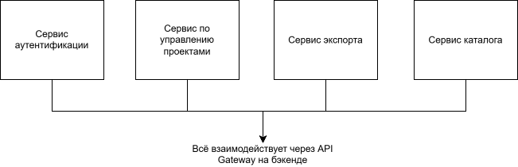
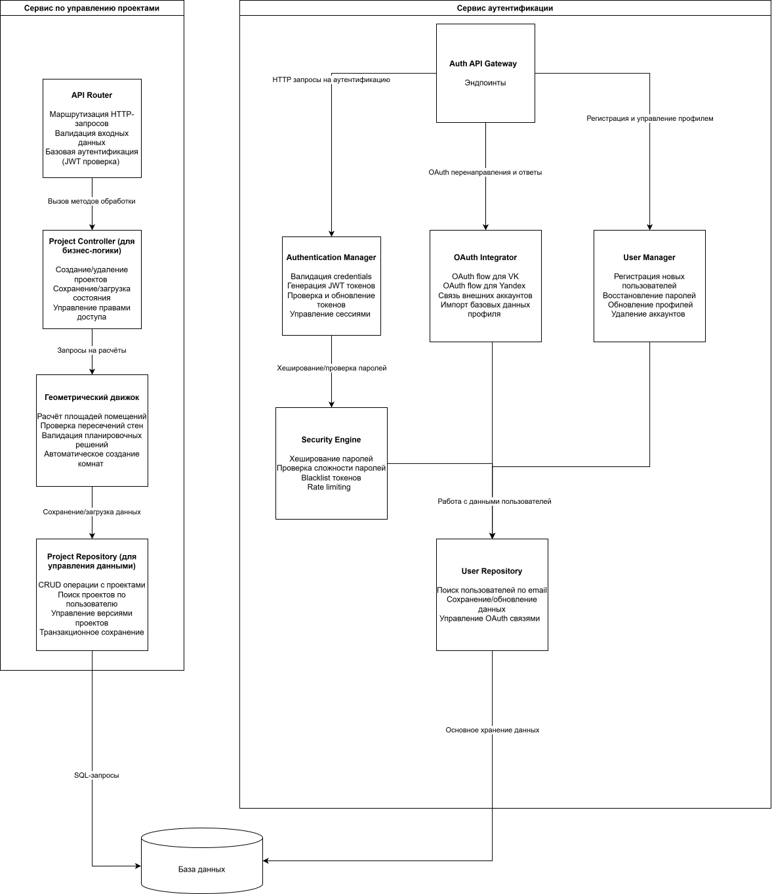

# Лабораторная работа №2

## Диаграмма системного контекста

Или по [ссылке](context%20diagram.svg)

## Диаграмма контейнеров

Или по [ссылке](container.svg)

В качестве архитектурного стиля выбрана микросервисная архитектура, потому что на это несть несколько причин:
- Неоднородность технологических требований, например, Сервис аутентификации обладает высокими требования к безопасности, использование специфичных библиотек OAuth, а
сервис экспорта требует тяжёлых библиотек для PDF (Например, Puppeteer), изоляция памяти критична

- Независимое масштабирование

- Устойчивость к отказам, например, падение сервиса экспорта не помешает пользователям редактировать существующие проекты.

## Диаграмма компонентов

Или по [ссылке](component.svg)

В качестве контейнеров были выбраны сервис авторизации и управления проектами, подробное описание на изображении под каждым компонентом