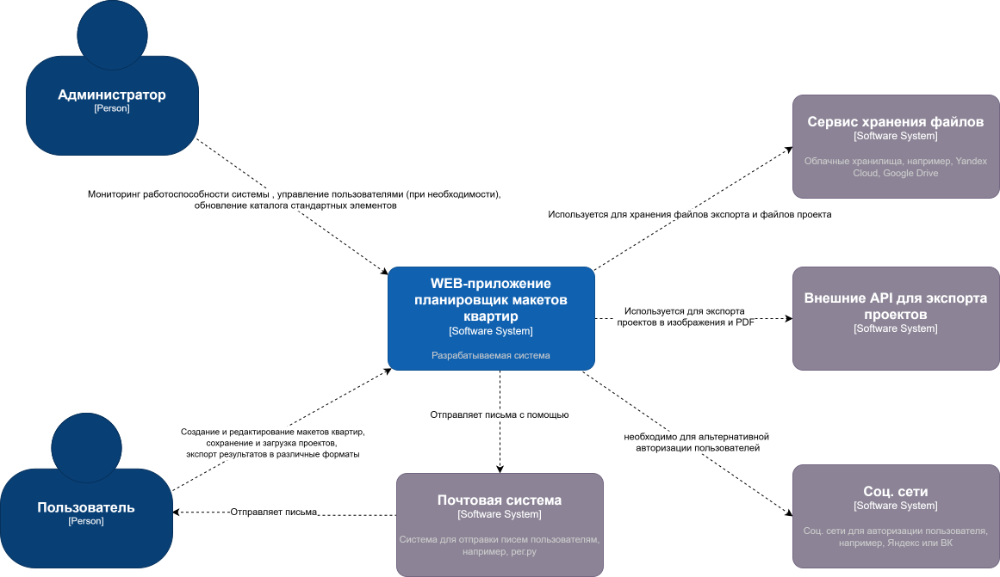
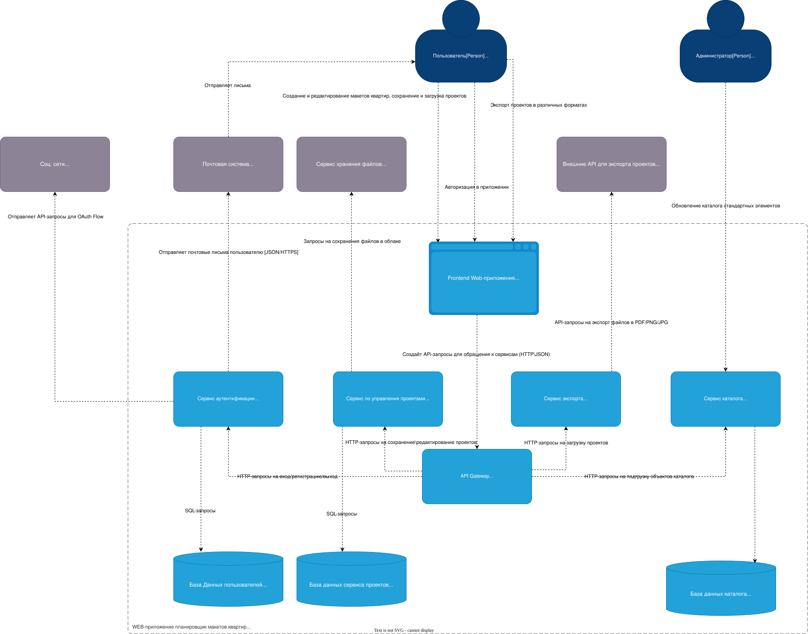
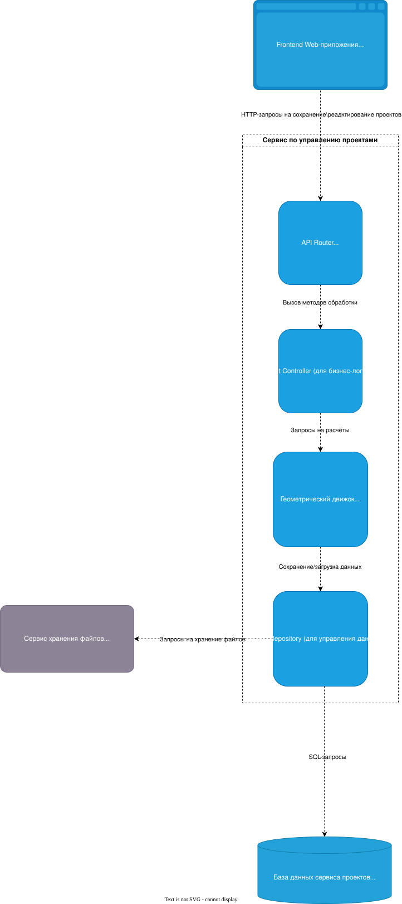
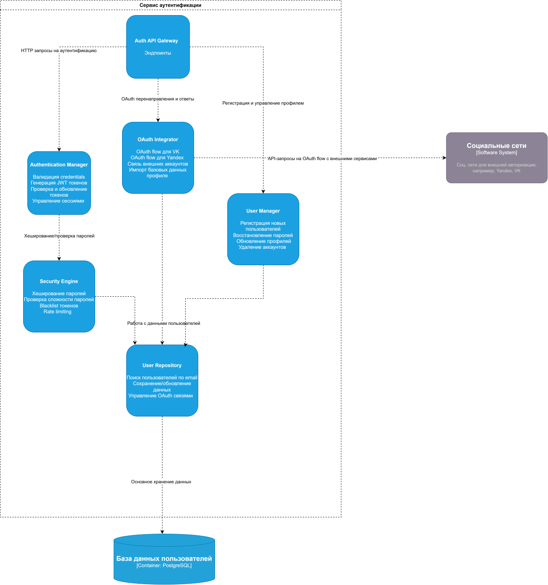

# Лабораторная работа №2

## Диаграмма системного контекста

Или по [ссылке](context%20diagram.svg)

## Диаграмма контейнеров

Или по [ссылке](cont.svg)

В качестве архитектурного стиля выбрана микросервисная архитектура, потому что на это несть несколько причин:
- Неоднородность технологических требований, например, Сервис аутентификации обладает высокими требования к безопасности, использование специфичных библиотек OAuth, а
сервис экспорта требует тяжёлых библиотек для PDF (Например, Puppeteer), изоляция памяти критична

- Независимое масштабирование

- Устойчивость к отказам, например, падение сервиса экспорта не помешает пользователям редактировать существующие проекты.

## Диаграмма компонентов

### Диаграмма компонентов контейнера сервиса по управлению проектами

Или по [ссылке](PM component.svg)

### Диаграмма компонентов контейнера сервиса аутентификации

Или по [ссылке](auth component.svg)